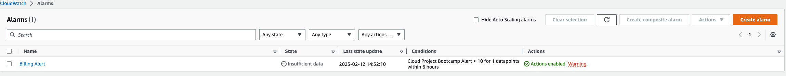
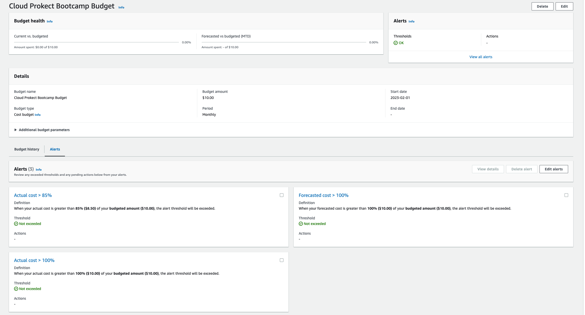
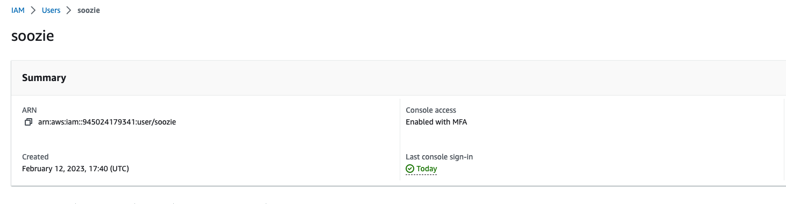
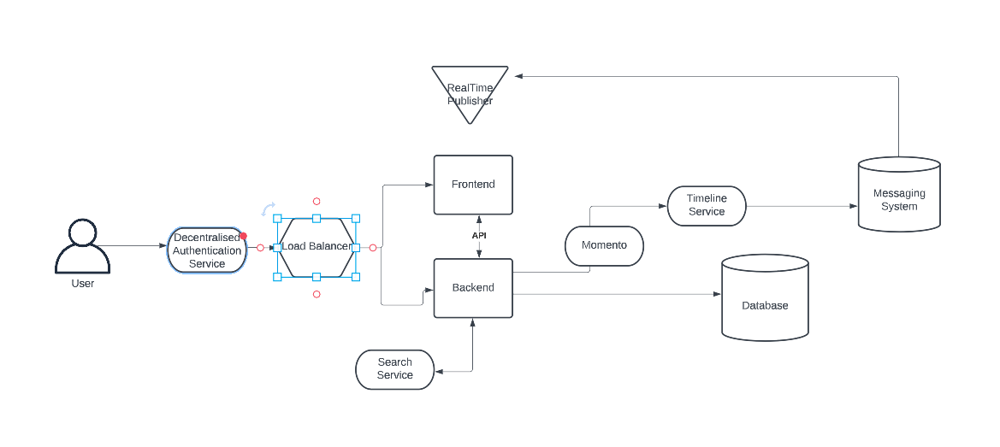

# Week 0 — Billing and Architecture

## Setting up my AWS account

- Set up billing alerts with Amazon CloudWatch

- Set up a cost budget with AWS Budgets

- Set up MFA for root user to improve security
- Set up IAM user 
    - Added this user to Admin user group  
    - Generated AWS credentials for this user, loaded them to my GitPod workspace using environment variables 
    - Set up MFA for this user 

- Used AWS CloudShell for the first time and played around with it 
    - Configured auto prompt

## Conceptual Architecture Diagram

### High Level Explanation of Conceptual Architecture
A user authenticates through an authentication service which verifies users. Once the user is authenticated, their request is forwarded to a load balancer, which is responsible for distributing incoming traffic evenly across the front-end and back-end application, providing high reliability and performance for the user. The front-end application is the user interface that the user will be interacting with, for us this is the Crudder website. The back-end application is responsible for handling user requests e.g accessing databases which store user information and requests. The front-end and back-end application communicate via an API.

The back-end application points to Momento, which is a serverless caching service, used to store user activity e.g when a user shares content on Crudder it is stored in Momento. Momento communicates with a Timeline Service which uses information cached by Momento to create a timeline of user activity. The Timeline Service also communicates with a Messaging System database, which stores user messages. The Real Time Publisher is responsible for publishing the latest content. 

### Considerations
Requirements for Crudder are that it is a social media platform that enables users to share __time-limited__ content. 
- This means that we need to set TTL on content that users share. This can be achieved by configuring TTL in Momento so that cached content will have a set duration. This set up means that expired content will not be accessible/exist in the cache and so will not be displayed to users
